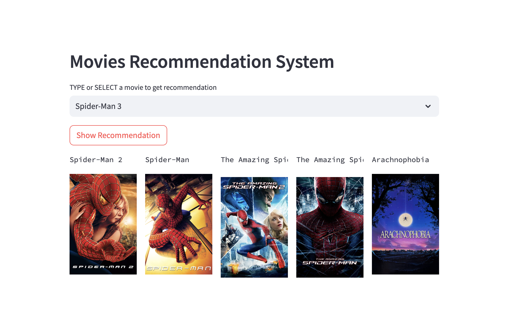
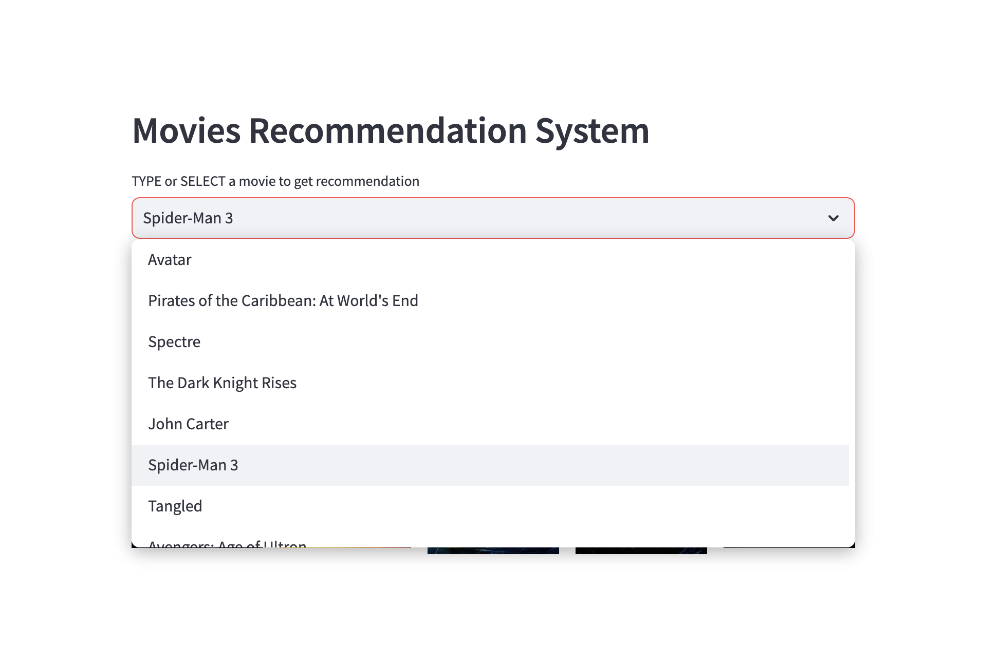

# Movie-Recommender-System-Web-App

This project implements a movie recommender system using Streamlit and content-based filtering. Users can enter or select a movie title and receive recommendations for similar movies. It is deployed to Heroku.

## Description

The system uses cosine similarity between movie vectors to find movies that are conceptually similar to the user's query. It builds an item-item matrix comparing movie plots, cast, crew, keywords, and genres to generate recommendations.

Cosine similarity measures the similarity between two vectors in an inner product space. It calculates the cosine of the angle between the vectors, determining if two movies point in roughly the same direction (high similarity) or different directions (low similarity). Values range from 0 to 1, with 1 indicating identical vectors.

The advantage of using cosine similarity is that it is an easy to interpret, efficient metric that works well for comparing text-based features like movie metadata. The model can capture nuanced similarities beyond just matching genre tags.

Users can input a movie title and the system will output the 5 most similar movies.

### Data Source:

The movie data comes from the [TMDB 5000 Movie Dataset](https://www.kaggle.com/tmdb/tmdb-movie-metadata?select=tmdb_5000_movies.csv).
The movie poster data from the [Movie - TMDb API](https://developer.themoviedb.org/reference/search-movie).

### Modeling Training Method:

The model training code builds a similarity matrix using scikit-learn. The trained model is serialized in a model.pkl file which is loaded by the Streamlit app for efficient prediction.

## Demo

A live demo of the movie recommender web app can be found here:

[Demo for Movie Recommender System Web App](https://movie-recommender-system-cici-9b72d5b559c2.herokuapp.com/)

Feel free to try it out with different movie titles!

## File Structure

- `Recommender System.ipynb`: Jupyter notebook for model training
- `data/`: Folder containing raw movie dataset 
- `artifacts/`: Saved model files and other artifacts
- `env/`: Virtual environment folder 
- `src/`: Source code folder
- `Procfile`: Heroku process file
- `requirements.txt`: Python package dependencies 
- `setup.py`: Python script for Heroku setup steps
- `setup.sh`: Shell script to run before launching app

## Credits

The movie data is property of TMDB. This project was created for educational purposes.
